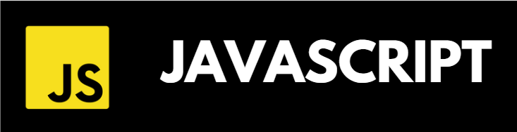

  
  <h1>Welcome to my GitHub profile 👋🏻</h1>

<h4 align="center">
  Hi! My name is Andres Felipe, I'm a 18-year-old software developer passionate about technology and constantly learning to improve my skills.
</h4>

<!-- -->

  

<h3 align="center">A summary of the technologies I have worked with and have hands-on experience in:</h3>

<!--         -->

<table align="center">
  <tr>
    <td></td>
    <td></td>
    <td></td>
    <td></td>
    <td></td>
  </tr>
  <tr>
    <td></td>
    <td></td>
    <td></td>
    <td></td>
    <td></td>
  </tr>
</table>

